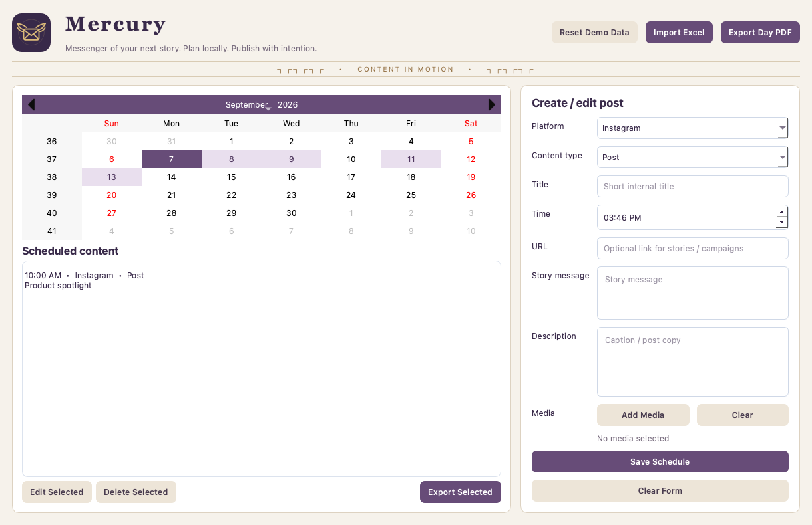

# Mercury

**Messenger of your next story.**

Mercury is a local desktop social media planner inspired by the Roman messenger god. A winged message emblem, restrained bronze details, and an ivory-and-plum workspace bring that identity into a practical calendar-based tool.



This is an actual application capture using fictional demo content.

## What it does

- Plan Instagram, Facebook, LinkedIn, TikTok, X / Twitter, and YouTube content.
- Create, edit, and delete Posts, Stories, and Reels from a calendar.
- Attach multiple local media files and prepare captions or story links/messages.
- Import validated `.xlsx` schedules, with row-specific errors and all-or-nothing saves.
- Export media bundles with `content.txt` and copy the matching text to the clipboard.
- Export a daily PDF overview with wrapped text.
- Keep schedules in SQLite between sessions; reset fictional demo content when wanted.

**Mercury plans and prepares content. It does not automatically publish to social networks or run a background posting service.** No account, API key, or internet connection is needed.

## Run locally

Install **Python 3.12** on a computer with a graphical desktop.

```bash
python3 -m venv .venv
source .venv/bin/activate
python -m pip install -r requirements.txt
python main.py
```

On Windows, use `python` to create the environment and `.venv\Scripts\activate` in Command Prompt to activate it.

The first launch creates `data/scheduler.db` with fictional sample posts. Subsequent launches preserve your schedules, including an intentionally empty calendar. Media attachments reference existing files; keep those files accessible until you export them.

## Try a complete workflow

1. Select a date and fill in a title, time, platform, and content type.
2. Add a caption (Post/Reel) or link and message (Story), then save.
3. Select the saved entry and choose Edit Selected to update it.
4. Add media and choose Export Selected to produce a new bundle in `exports/`.
5. Export Day PDF for a printable overview.

Each bundle gets its own folder; repeated exports and same-named attachments cannot overwrite previous output. Missing attachments are reported before export.

## Excel import

Use [the fictional sample workbook](sample_data/sample_schedule.xlsx). Only `.xlsx` files are supported.

| Column | Required | Format |
| --- | --- | --- |
| Date | Yes | YYYY-MM-DD or Excel date |
| Time | Yes | hh:mm AM/PM, HH:MM, or Excel time |
| Type | Yes | Post, Story, or Reel |
| Title | Yes | Nonempty text |
| Platform | No | Listed platform; defaults to Instagram |
| URL, Message, Description | No | Text; blank cells stay blank |

Review imports before exporting. Reimporting a workbook adds another copy of its posts.

## Tests

```bash
python -m unittest discover -s tests -v
```

Tests cover persistence, calendar/form create-edit-delete, empty-calendar restart, spreadsheet validation, atomic import, missing media, filename collisions, text selection, and PDF generation. Qt tests use its offscreen mode; GitHub Actions runs these checks for every push and pull request.

## Project layout

```text
assets/          Original Mercury winged-message SVG
src/app.py       PyQt6 calendar and forms
src/models.py    Post validation and content selection
src/database.py  SQLite persistence
src/exporters.py Workbook import, PDF and media bundles
tests/           Data, export, and actual Qt form tests
sample_data/     Fictional workbook
screenshots/     Working-app screenshot
```

## Privacy and limits

Schedules stay on this computer. Generated databases, exports, environment files, and caches are excluded from Git. Reset Demo Data removes your local posts after confirmation. Back up your database separately if you use the planner beyond the demo.

No social network publishing, cloud sync, notifications, timezone conversion, or team accounts are implemented. The PDF is a short daily overview (up to 120 characters of each content field); the media bundle retains the complete text. See [verification](docs/VALIDATION.md).

Built as a portfolio project by **Alexander Boles**.
